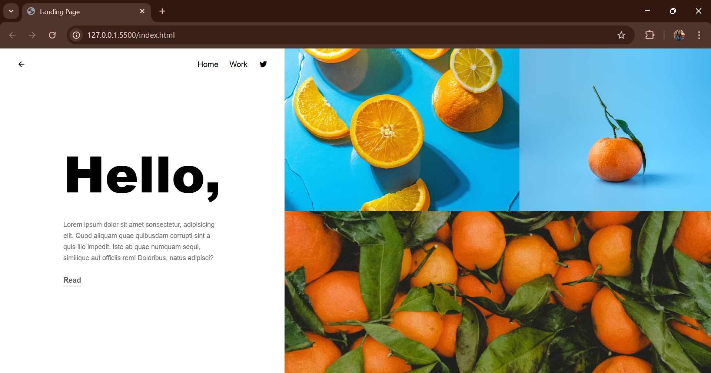

# Landing Page

A simple responsive landing page built using **HTML** and **CSS**.  
The layout is divided into two main sections:
- **Left section** → Navigation bar and text content.
- **Right section** → Split into a top area (two images side by side) and a bottom area (one large image).

## 🚀 Features
- Clean two-column layout (40% left, 60% right).
- Responsive design with media query support for mobile devices.
- Uses **Remix Icons** for icons.
- Background images fetched from **Unsplash**.
- Flexbox-based alignment.

## 📂 Project Structure
├── index.html # Main HTML file
├── style.css # Styling (responsive layout, flexbox, images, typography)

## 🛠️ Technologies Used
- HTML5
- CSS3 (Flexbox, Media Queries)
- [Remix Icon](https://remixicon.com/) for icons
- [Unsplash](https://unsplash.com/) for background images

## 📱 Responsive Design
- Desktop view → Two-column layout (left text, right images).
- Mobile view → Stacked layout (left on top, right below).

## 📸 Preview

## 🙌 Author
- Designed & developed by Khushi Gupta

